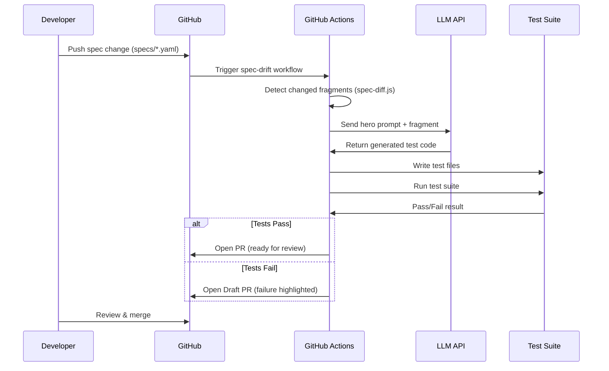

# Auto-Regeneration Pipeline

## Overview

This pipeline closes the loop between spec changes and test generation. When an OpenAPI fragment is edited, tests are automatically regenerated and verified.

## Sequence Diagram

## Components

1. **`scripts/spec-diff.js`** — Detects which specs changed and summarizes changes
2. **`scripts/regenerate-tests.js`** — Calls LLM API with hero prompt + spec, writes test files
3. **`.github/workflows/spec-drift.yml`** — Triggers on spec changes

## Cost Guardrails

- Maximum 50k characters per fragment (prevents runaway costs)
- Token count is logged per regeneration
- Estimated cost: ~$0.05-0.15 per regeneration at Claude Sonnet rates
- At 1 spec change/day: ~$1.50-4.50/month

## Direct Test Edit Detection

If a developer edits test files directly without a corresponding spec change, the CI pipeline will flag this with a warning, encouraging spec-first development.
