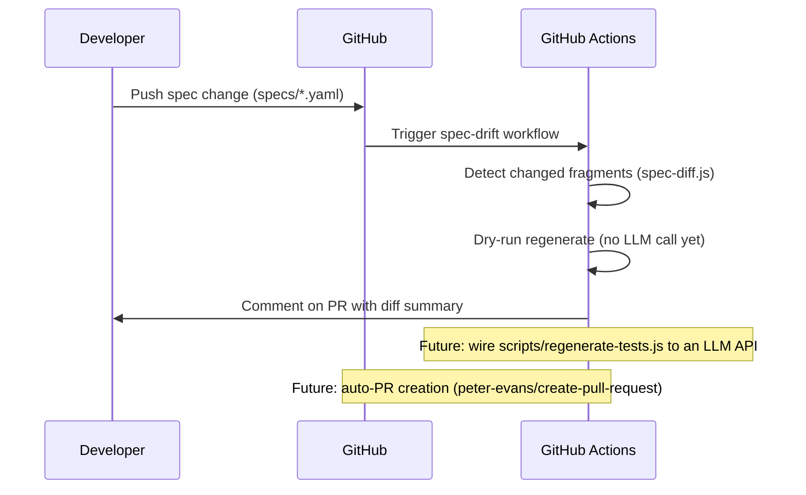

# Auto-Regeneration Pipeline

## Overview

This pipeline detects spec changes and prepares for test regeneration. **Current status: dry-run only.** The LLM call and auto-PR creation are not yet implemented.

## Sequence Diagram (Current State)

## Components

1. **`scripts/spec-diff.js`** — Detects which specs changed and summarizes changes
2. **`scripts/regenerate-tests.js`** — Validates hero prompt + spec (LLM call is TODO)
3. **`.github/workflows/spec-drift.yml`** — Triggers on spec changes

## What Works Today

- Spec-change detection (`spec-diff.js`) runs and summarizes diffs
- Dry-run mode validates that the hero prompt and spec fragment load correctly
- CI workflow triggers and reports changes

## What's Not Yet Implemented

- Actual LLM API call to generate test code
- Auto-PR creation with generated tests
- Test execution of generated code before PR

## Cost Guardrails (for when LLM call is wired)

- Maximum 50k characters per fragment (prevents runaway costs)
- Token count will be logged per regeneration
- Estimated cost: ~$0.05-0.15 per regeneration at Claude Sonnet rates
- At 1 spec change/day: ~$1.50-4.50/month

## Direct Test Edit Detection

If a developer edits test files directly without a corresponding spec change, the CI pipeline will flag this with a warning, encouraging spec-first development.
